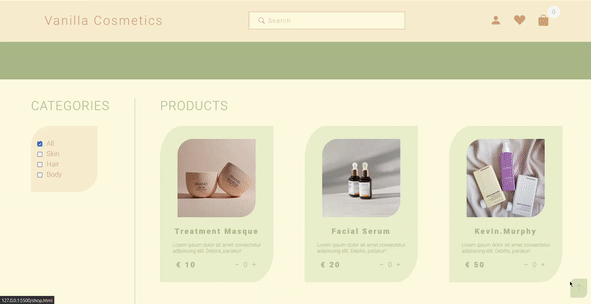
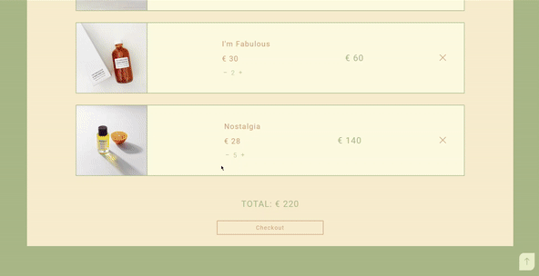
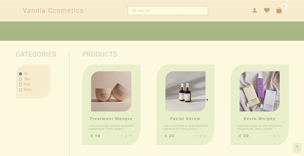
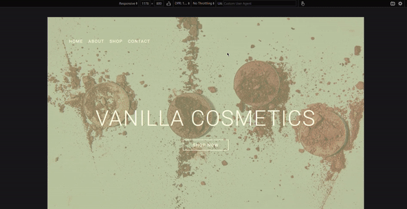

# Vanilla Cosmetics - a beauty eCommerce website | [LIVE DEMO](https://rusdiana97.github.io/vanilla-cosmetics.github.io/)

## 1. Project Description

*Vanilla Cosmetics* is a personal project about a beauty eCommerce site. The website is developed with:
- HTML
- CSS
- JavaScript

*I used Visual Studio Code to write the website code.*

On this project you can find the following: 

- responsive web design 
- multi page website
- local storage available
- navigation bar with menu
- scroll to top
- add a product to the cart
- choose the quantity for the chosen product
- see your shopping cart
- delete a product from the shopping cart
- empty the shopping cart
- checkout your order
- see your total bill
- see your total bill per product
- see the number of products you selected on the menu bar
- automatically update your shopping cart icon located on the menu bar when you add/delete a product
- 3D animations 
- transitions 

## 2. How to Install / Run the Project

**To install / run the project, you have two choices:**
1. download the entire project on your computer from Code -> Download Zip and open the index.html file on your browser for running the project
2. click on [LIVE DEMO](https://rusdiana97.github.io/vanilla-cosmetics.github.io/) for running the project on your browser (you won't download the project)

**I recommend you to see the [LIVE DEMO](https://rusdiana97.github.io/vanilla-cosmetics.github.io/) of the project.**

**The website was tested functional and non-functional and works perfectly on the following browsers:**
- Mozilla Firefox
- Google Chrome
- Opera

**For testing the responsive web design I used the Responsive Design Mode from the Mozilla Firefox and it works perfectly so feel free to try the website on another device besides the computer or laptop.**

## 3. How to Use the Project

 When you open the website on your browser you will see the main page or the index page:

The purpose of this page is to give you an idea about *Vanilla Cosmetics*. The page has a button with the path to the shop page. You can navigate to the shop page also from the navigation bar or from the footer. Based on the navigation bar you can also go to the *About section* or to the *Contact section*. The *About section* is for a short description of the website with its shop services which are 3D animated (hover over them). The last thing on the *About section* is a button which leads you to the shop page. Next is the *Contact section* based on a form where the user can message direct the administrator of the shop. The page has also a *footer* with links. *To go up to the page* click the up-arrow fixed on the right-bottom of the page. 

*Notice that the index page has a reveal animation.*

Let's say that we clicked on the button **SHOP NOW** from the top page for nagivate to the shop page. 

Here we see the products from the shop with some categories on the left side. First of all we need to notice that the navigation bar is changed. From there we can go back to the index page, we have a search bar and some icons for: user account, favorite products, shopping cart. 

Let's just take a look on this page:

From here we are interested on the **shop** and on the **shopping cart**. How the shop is working? 

Let's select some products with different quantities and go to our shopping cart:

On the shopping cart we can see the products that we selected with the following characteristics:
- name
- price per item
- price per total quantity of the item
- total bill

We can choose from here another quantity of a product, we can delete it, we can empty the shop or we can checkout our order.

Our shopping cart will update automatically with the number of products that we selected.

I have good news if you are not sure about the order and want to think again: I create a localStorage for your data so you can close/refresh the browser/go to the index page and it will be available on the next time: 

To prove that the design is web responsive, I tested it on iPhone Pro Max iOS 14.6 from Mozilla Firefox's Responsive Design Mode:

*Try the website's functionalities in your browser for a personal experience: https://rusdiana97.github.io/vanilla-cosmetics.github.io/.*

## 4. Credits

 - [Bootstrap Icons](https://icons.getbootstrap.com)
 - [Google Fonts](https://fonts.google.com)
 - [Icon Title Bar Link](https://www.iconfinder.com/icons/4171280/day_handbag_heart_love_valentine_valentines_wedding_icon)
 - [Unsplash Images](https://unsplash.com):
 1. https://unsplash.com/photos/3J4HyvV9bwY
 2. https://unsplash.com/photos/xo0XVEK9nts
 3. https://unsplash.com/photos/xTLqJqtq8R4
 4. https://unsplash.com/photos/PEttXYw9hi8
 5. https://unsplash.com/photos/75EP-T7dv-4
 6. https://unsplash.com/photos/3picpvVQiVM
 7. https://unsplash.com/photos/ZZCZzfNYMLE
 8. https://unsplash.com/photos/s4BgaM4dcqQ
 9. https://unsplash.com/photos/WnVrO-DvxcE
 10. https://unsplash.com/photos/ZiiMjTnwohE
 11. https://unsplash.com/photos/WKTyFX8gAJI
 12. https://unsplash.com/photos/q7jxQHlLPQg
 13. https://unsplash.com/photos/nB_K8jWAiVE
 14. https://unsplash.com/photos/rPPMuH_DhYg
 15. https://unsplash.com/photos/NLz3Wy8Thac
 16. https://unsplash.com/photos/lWcstd_N5S4
 17. https://unsplash.com/photos/7m-aAY8fLrE
 18. https://unsplash.com/photos/uYqQQ4As5cQ
 19. https://unsplash.com/photos/tAzdKblAinw
